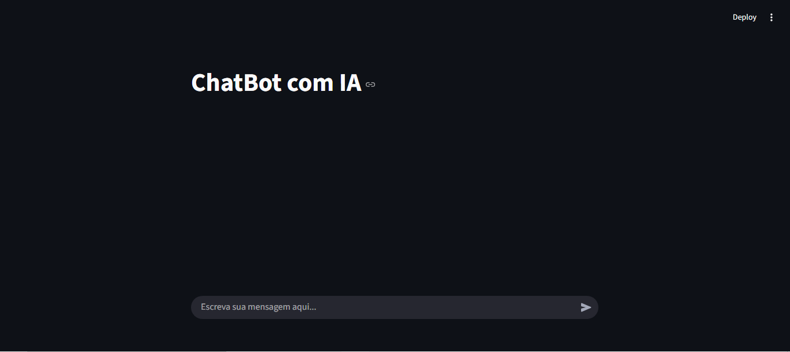

# Título
## ChatBot com IA usando Streamlit e OpenAI

---

# Objetivo do Projeto
O objetivo deste script é criar um chatbot interativo que utiliza a API do OpenAI
para gerar respostas, enquanto o Streamlit cuida da interface visual e do
gerenciamento do estado da conversa.

---

# Estrutura da Aplicação
1. **Frontend e Backend:** Streamlit
2. **Input do Usuário:** st.chat_input
3. **Histórico de Mensagens:** st.session_state
4. **Resposta da IA:** API do OpenAI
5. **Exibição:** st.chat_message
"""
---

